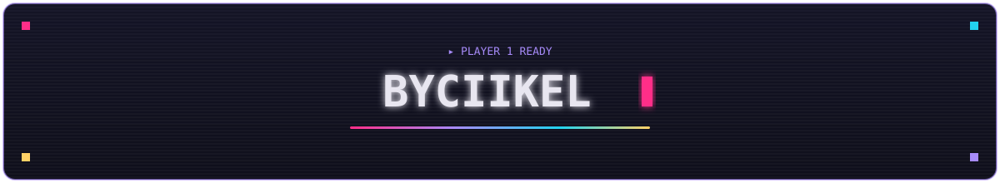
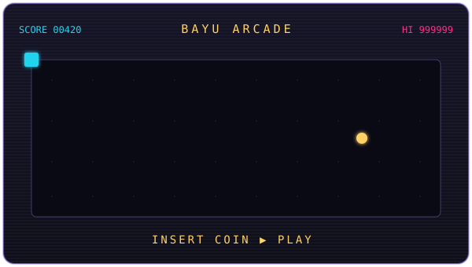

  

> software engineer · javascript · ruby · press start ▶

 

  
  <h3>
    <a href="https://byciikel.my.id">insert coin ▶ play</a>
  </h3>

 

**inventory:** JavaScript · Ruby · React · React Native · Node.js · RedwoodJS · Tailwind CSS

  

### posts

<!-- BLOG-POST-LIST:START -->
- [Is RedwoodJS Worth Looking Into?](https://medium.com/simpul-technologies/is-redwoodjs-worth-looking-into-214933f9b114?source=rss-b98a4a854a45------2)
- [Setting up react-router-dom untuk routing page React JS](https://medium.com/@byciikel/setting-up-react-router-dom-untuk-routing-page-react-js-39e78975e534?source=rss-b98a4a854a45------2)
- [Konfigurasi Tailwind CSS di React JS](https://medium.com/@byciikel/konfigurasi-tailwind-css-di-react-js-1c70a86fa359?source=rss-b98a4a854a45------2)
- [Membuat React JS tanpa cretae-react-app](https://medium.com/@byciikel/membuat-react-js-tanpa-cretae-react-app-fb2f57943fb5?source=rss-b98a4a854a45------2)
- [Deteksi Mock Location menggunakan React Native](https://medium.com/@byciikel/deteksi-mock-location-menggunakan-react-native-1847d3e6b053?source=rss-b98a4a854a45------2)
<!-- BLOG-POST-LIST:END -->

 

  
  &nbsp;&nbsp;
  

